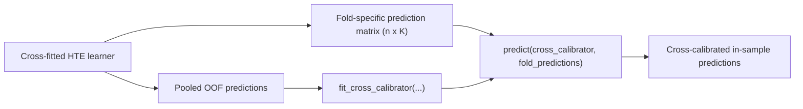

# Why cross-calibration is central

Cross-calibration is the main workflow when your upstream treatment-effect model was trained with cross-fitting.

It lets you fit and calibrate in sample without spending a separate holdout calibration set.

# What “fit and calibrate in sample” means here

It means:

- all observations contribute to the overall workflow,
- but the prediction objects used in calibration still respect the fold structure of the upstream learner,
- so the final calibrated predictions are assembled from fold-specific predictions rather than from a single overfit in-sample score.

# Required objects

| Object | Shape | Role |
|---|---|---|
| `predictions` | length `n` | pooled out-of-fold predictions used to fit the calibration map |
| `fold_predictions` | `n x K` | one column per fold-specific predictor, used for calibrated aggregation |
| nuisance inputs | length `n` | required by the chosen loss |

# Step-by-step workflow



## Python

```python
from causal_calibration import fit_cross_calibrator

cross_calibrator = fit_cross_calibrator(
    predictions=tau_oof,
    fold_predictions=tau_fold_matrix,
    treatment=a,
    outcome=y,
    mu0=mu0_hat,
    mu1=mu1_hat,
    propensity=e_hat,
    loss="dr",
    method="isotonic",
)

tau_cross_calibrated = cross_calibrator.predict(tau_fold_matrix)
```

## R

```r
cross_calibrator <- fit_cross_calibrator(
  predictions = tau_oof,
  fold_predictions = tau_fold_matrix,
  treatment = a,
  outcome = y,
  mu0 = mu0_hat,
  mu1 = mu1_hat,
  propensity = e_hat,
  loss = "dr",
  method = "isotonic"
)

tau_cross_calibrated <- predict(cross_calibrator, tau_fold_matrix)
```

# How aggregation works

Version 1 aggregates calibrated fold-specific predictions with the order-statistic median. This is more than a convenience detail: it is the actual prediction contract of the current cross-calibration API.

# In-sample vs out-of-sample

## In-sample cross-calibrated predictions

Use the same `n x K` fold-prediction matrix built for the training observations. This is the main “fit and calibrate in sample” workflow.

## Out-of-sample predictions

For a new sample, build the same kind of `m x K` matrix by applying each fold-specific predictor to the new observations, then pass that matrix to `predict(cross_calibrator, ...)`.

# Common mistakes

- Passing a single prediction vector to `fit_cross_calibrator()` instead of pooled OOF predictions.
- Passing only one calibrated prediction column instead of the full fold-specific matrix.
- Forgetting that `fit_cross_calibrator()` fits on `predictions` but predicts from `fold_predictions`.

# Full walkthroughs

- Python notebook: [examples/python-workflow.ipynb](../examples/python-workflow.ipynb)
- R vignette: [r/causalCalibration/vignettes/getting-started.Rmd](../r/causalCalibration/vignettes/getting-started.Rmd)
